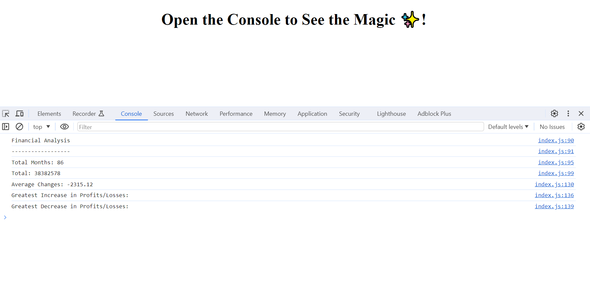

# Console-Finances

## Description

This project analyses a financial dataset using JavaScript to calculate key metrics:
Total number of months
Net total amount of Profit/Losses
Average changes in Profit/Losses
Greatest increase in Profit/Losses (date and amount)
Greatest decrease in Profit/Losses (date and amount)

## Table of Contents

* [Installation](#installation)
* [Usage](#usage)
* [Credits](#credits)
* [License](#license)

## Installation

1) git clone git@github.com:username/repo.git
2) Change into project's directory
3) Start application on VS code

## Usage 

1) Upon loading, the index.html page the console log shows analysis of dataset using javascript. 

## Credits

Copyright © 2023 Sumayyah Akther Emama. All Rights Reserved.

## License

Licensed under the MIT license

## Deployment 
https://sae9.github.io/Console-Finances/
